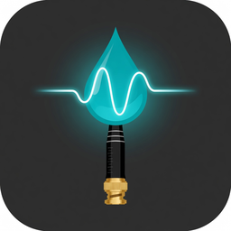

# EZO Complete-ORP — Home Assistant

[](https://github.com/hacs/integration)
[](LICENSE)

Intégration Home Assistant pour le kit USB **Atlas Scientific EZO Complete-ORP**.

- **Découverte USB** automatique (FTDI) puis **vérification obligatoire** via la commande `i` (accepte uniquement un circuit ORP)
- **Config Flow** + Options Flow, multi-appareils
- Lecture ORP live, mode continu, calibration 225 mV / personnalisée **en regardant la valeur se stabiliser**
- LED, Sleep, Find, Status, reset usine, échelle ORP étendue, export/import de calibration
- Communication **serialx** (HA 2026.5+), `DataUpdateCoordinator`, `runtime_data`
- Versionnement **CalVer** `YYYY.M.D`
- Traductions **FR / EN**, diagnostics, brand assets locaux

<p align="center">
  
</p>

## Installation (HACS — recommandé)

1. Installer [HACS](https://hacs.xyz/) si ce n’est pas déjà fait.
2. HACS → **⋮** → *Custom repositories*
3. URL : `https://github.com/echavet/ezo-orp`  
   Catégorie : **Integration**
4. HACS → Integrations → rechercher **EZO Complete-ORP** → Download
5. **Redémarrer** Home Assistant
6. Brancher le module USB — HA propose la découverte, **ou** *Paramètres → Appareils et services → Ajouter une intégration* → **EZO Complete-ORP**

### Mise à jour

HACS notifie les nouvelles versions (tags / GitHub Releases au format `YYYY.M.D`).  
Update en un clic → redémarrer HA.

## Installation manuelle

1. Copier `custom_components/ezo_complete` dans `config/custom_components/`
2. Redémarrer Home Assistant
3. Ajouter l’intégration **EZO Complete-ORP**

Home Assistant **2026.5** ou plus récent est requis (`serialx` + sélecteur de port série).

## Configuration

| Champ | Description | Défaut |
|-------|-------------|--------|
| Port série | Chemin USB (`/dev/serial/by-id/…` de préférence) | — |
| Baudrate | Débit UART | `9600` |
| Nom | Nom affiché | `EZO Complete-ORP` |

La commande `i` est toujours envoyée avant de créer l’entrée. Un dongle FTDI générique (pas ORP) est **refusé**.

### Options

Sur l’entrée d’intégration → **Configurer** :

| Option | Description | Défaut |
|--------|-------------|--------|
| Intervalle de polling | Rafraîchit les diagnostics ; envoie `R` si le mode continu est off | 5 s |
| Mode continu au démarrage | Recommandé (`C,n`) | activé |
| Période continue | `C,<n>` en secondes | 1 s |

## Entités principales

| Type | Entités |
|------|---------|
| Sensor | ORP (mV), infos appareil, raison du reset, tension, état de calibration |
| Switch | Mode continu, LED, échelle ORP étendue (diag.) |
| Number | Valeur de calibration personnalisée, intervalle continu |
| Button | Calibrer 225 mV, calibrer custom, effacer, Find, Sleep, export, reset usine |

Détails : [docs/ENTITIES.md](docs/ENTITIES.md)

## Calibration

La calibration **ne se fait pas** dans le Config Flow.

1. Plonger la sonde dans la solution (typiquement 225 mV)
2. Observer le capteur **ORP** jusqu’à stabilisation
3. Appuyer sur **Calibrer 225 mV** — ou régler le number puis **Calibrer la valeur personnalisée**

Aucune calibration « aveugle » n’est envoyée automatiquement.

## Notes fonctionnelles

- Identifiant stable = **numéro de série FTDI** + type `orp`
- Débranchement USB : les entités passent indisponibles, reconnexion automatique
- Reset usine : premier appui = armement 30 s, second appui = exécution (ou service `confirm: true`)
- Le kit est déjà isolé électriquement — aucune isolation logicielle supplémentaire

## Développement

```bash
python -m pytest tests/ -q
```

## Licence

MIT — voir [LICENSE](LICENSE).

Protocole UART documenté à partir des datasheets Atlas Scientific EZO Complete-ORP / EZO-ORP.  
Intégration communautaire, non affiliée à Atlas Scientific.
